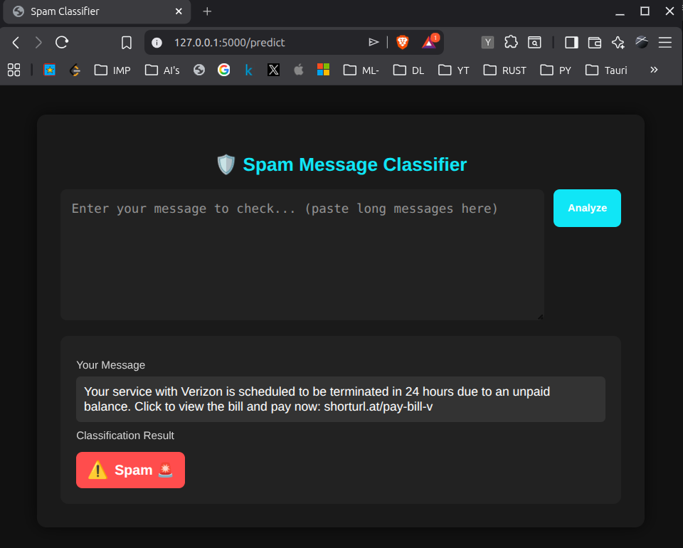
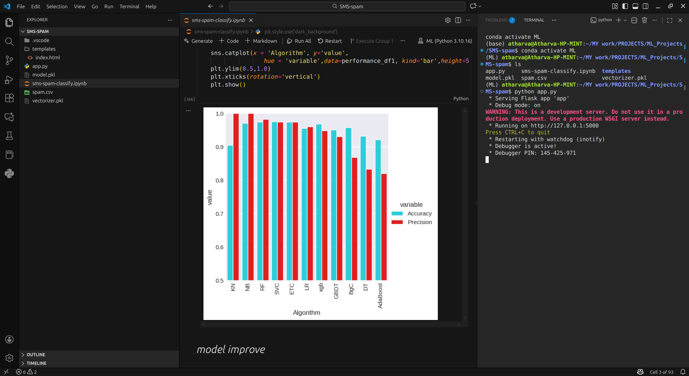

# SMS Spam Classifier

## Overview

The SMS Spam Classifier is a Machine Learning project that classifies SMS messages as **Spam** or **Ham (Not Spam)** using Natural Language Processing (NLP) techniques. The model is trained on a labeled SMS dataset and uses text preprocessing, TF-IDF vectorization, and machine learning algorithms to achieve accurate predictions.

## Features

* Classifies SMS messages as Spam or Ham
* Text preprocessing and cleaning
* TF-IDF feature extraction
* Machine Learning-based classification
* User-friendly prediction interface
* High accuracy on test data

## Technologies Used

* Python
* Pandas
* NumPy
* Scikit-Learn
* NLTK
* TF-IDF Vectorizer
* Naive Bayes Classifier
* Streamlit (Optional for deployment)

## Dataset

The project uses the SMS Spam Collection Dataset containing thousands of labeled SMS messages categorized as:

* Spam
* Ham (Not Spam)

Dataset Source:
https://www.kaggle.com/datasets/uciml/sms-spam-collection-dataset

## Project Workflow

1. Data Collection
2. Data Cleaning
3. Text Preprocessing

   * Lowercasing
   * Tokenization
   * Stopword Removal
   * Stemming
4. Feature Extraction using TF-IDF
5. Model Training
6. Model Evaluation
7. Spam Prediction

## Model Performance

| Metric    | Score |
| --------- | ----- |
| Accuracy  | 95%+  |
| Precision | High  |
| Recall    | High  |
| F1 Score  | High  |

*Performance may vary depending on preprocessing and model configuration.*

## Installation

Clone the repository:

```bash
git clone https://github.com/your-username/sms-spam-classifier.git
```

Navigate to the project directory:

```bash
cd sms-spam-classifier
```

Install dependencies:

```bash
pip install -r requirements.txt
```

Run the application:

```bash
python app.py
```

## Example

Input:

```text
Congratulations! You have won a free lottery ticket. Claim now!
```

Output:

```text
Spam
```

Input:

```text
Hey, are we still meeting at 5 PM today?
```

Output:

```text
Ham
```

## Future Improvements

* Deep Learning implementation using LSTM
* BERT-based text classification
* Web deployment with Streamlit
* Multi-language spam detection
* Real-time SMS filtering


## 📸 Screenshots


*Main interface for SMS classification*


*Example of spam detection result*

## 📁 Project Structure

```
SMS-SPAM/
│
├── app.py                      # Main Flask application file (to deploy/ test)
├── model.pkl                   # Pre-trained ML classifier model
├── vectorizer.pkl              # Pre-trained TfidfVectorizer object
├── spam.csv                    # Dataset used for training
├── sms-spam-classify.ipynb     # Jupyter notebook with model training code
├── requirements.txt            # Python dependencies
├── README.md                   # Project documentation
│
├── templates/
│   └── index.html              # Web interface HTML file
│
└── screenshots/                # (Optional) Application screenshots
    ├── demo1.png
    ├── demo2.png
    └── overview.png
```

## 🛠 Technology Stack

| Component | Technology | Description |
|-----------|-----------|-------------|
| **Backend** | Python 3.x, Flask | Core programming language and web framework |
| **ML Libraries** | Scikit-learn, Pandas, NumPy | Data processing, model training, and prediction |
| **Model Persistence** | Pickle | Serialization of trained models |
| **Frontend** | HTML, CSS | Structure and styling of the web interface |

## 🚀 Installation and Setup

### Prerequisites

- Python 3.10.16
- pip (Python package manager)

### Setup Steps

1. **Clone the repository:**

```bash
https://github.com/Atharva3164/SMS-Spam-Classifier-.git
cd SMS-SPAM
```

2. **Create a virtual environment (recommended):**

```bash
# Create virtual environment
python -m venv venv

# Activate virtual environment
# On Windows:
venv\Scripts\activate
# On macOS/Linux:
source venv/bin/activate
```

3. **Install dependencies:**

```bash
pip install -r requirements.txt
```

4. **Run the application:**

```bash
python app.py
```

The application will start running on `http://127.0.0.1:5000/`

## 💡 Usage

1. Open your web browser and navigate to `http://127.0.0.1:5000/`
2. Enter an SMS message in the text area
3. Click the **"Predict"** or **"Classify"** button
4. View the prediction result: **HAM** (legitimate) or **SPAM**

### Example Messages to Try:

**Spam Example:**
```
Congratulations! You've won a $1000 gift card. Click here to claim now!
```

**Ham Example:**
```
Hey, are we still meeting for lunch tomorrow at 1pm?
```

## 🧠 Model and Methodology

The classification pipeline consists of two main components:

### 1. Text Vectorization
- **Technique**: TF-IDF (Term Frequency-Inverse Document Frequency)
- **Purpose**: Converts raw text messages into numerical feature vectors
- **File**: `vectorizer.pkl`

### 2. Classification Model
- **Algorithm**: Machine Learning classifier (trained in `sms-spam-classify.ipynb`)
- **Training Data**: SMS spam dataset (`spam.csv`)
- **File**: `model.pkl`

### Model Pipeline:
1. Input SMS text → TF-IDF Vectorizer → Numerical features
2. Numerical features → Trained Classifier → Prediction (Spam/Ham)

## 📊 Dataset

The model is trained on `spam.csv`, a collection of SMS messages labeled as spam or ham. The dataset includes:
- Legitimate messages (Ham)
- Spam messages from various sources
- Pre-processed and cleaned text data

## 🔧 Development

To retrain the model or explore the training process:

1. Open `sms-spam-classify.ipynb` in Jupyter Notebook or JupyterLab
2. Follow the notebook cells to see data exploration, preprocessing, and model training
3. Modify hyperparameters or try different algorithms as needed


## Dataset
[Spam.csv](https://www.kaggle.com/datasets/uciml/sms-spam-collection-dataset)


## 👨‍💻 Author

Sakshi Chobhe


